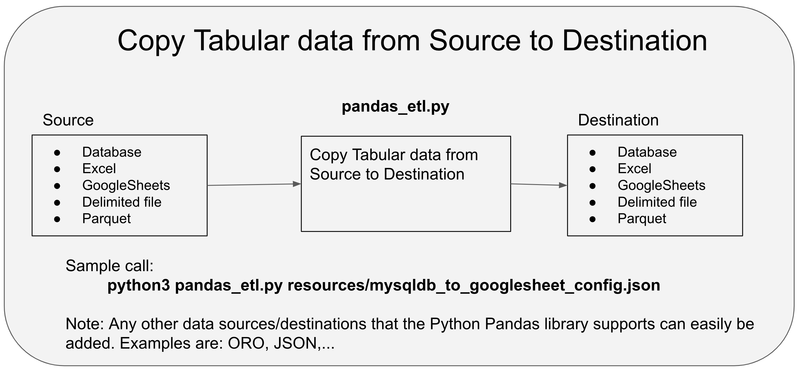

# Repo Overview
This repo contains code that allows data to be copied to/from different data repositories including databases and googlesheets.  It is a D2D service offering. Although it can copy to/from different datasources the primary use would be to copy to/from GoogleSheets.

# Summary
* **pandas_etl.py** - A python program that copies data from database tables, GoogleSheets, Excel files, Delimited files (for example CSV), and parquet
files to a different destination type (also a database table, GoogleSheets etc). For example the code can read a googlesheet and copy that data into a database table,excel file, csv file, or parquet file. 
 In particular this is useful for copying from GoogleSheets to a database table or a database table to GoogleSheets as by moving data to the same location it makes it easier for users to combine various datasets. 
 The implementation looks as follows: 
   * datasource -> Pandas DataFrame -> destination. 
   
The details of this capability will be explained below.
 
# GSA Usage 
 One current known GSA/OCFO project leverages this pandas_etl library. It copies googlesheets to/from a mysql database as part of its workflow: https://github.com/GSA/Performance_CXO_Dashboards

# pandas_etl.py

The following diagram depicts how 'pandas_etl.py' works: 

## Further explanation of pandas_etl.py:

As an example a GoogleSheet API could be called to get
spreadsheet data and this data would be converted to a Pandas DataFrame and the DataFrame could be saved
 to a database table.  Currently, database (sql), Excel, delimited files, parquet files and GoogleSheets are allowed
as both sources and destinations. The Panda's library is used to implement pandas_etl.py and so any
data format that Pandas supports could also easily be added (ORO, JSON, Tableau hyper/extract files..). See the following for the possible pandas datasources and
datasinks: https://pandas.pydata.org/pandas-docs/stable/reference/io.html

pandas_etl.py takes a config file (json) as an argument. This file has configuration information for both the
source and destination.  The following directory has examples for all supported sources and destinations: https://github.com/GSA/d2d-pandas-etl/tree/master/resources.

## Examples:

A few examples follow.  The examples can be invoked from within the 'pandas' directory. For a list of the possible config properties see the [Config properties README doc](https://github.com/GSA/d2d-pandas-etl/tree/main/resources/README.md). For example config files click [here](https://github.com/GSA/d2d-pandas-etl/tree/master/resources).

(Note: In the cases of mysql and GoogleSheets examples you would need to change them to use your respective credentials. In some cases such as parquet files you would need to install the standard libraries that pandas requires for handling parquet format.):
* Copy an in memory data structure to a sql lite internal database.  This example can be run as is so is a good starting point:
  * **python pandas_etl.py resources/memory_to_sqllitedb_config.json**
* Copy an Excel table to a sqllite database (works as is)
  *  **python pandas_etl.py resources/excel_to_sqllitedb_config.json**
* Copy a mysql table to GoogleSheets (change credentials)
  * **python pandas_etl.py resources/mysqldb_to_googlesheet_config.json**
* Copy a dummy memory table to GoogleSheets (change credentials)
  * **python pandas_etl.py resources/memory_to_googlesheet_config.json**
* Copy a large googlesheet to a sql lite table (change credentials). The sheet had about
  110,000 rows and 10 columns (8 columns contained short strings, one column contained
  an integer and one column contained a date). It took about 80 seconds to run.
  * **python pandas_etl.py resources/biggooglesheet_to_sqllitedb_config.json**
* Use operating system variables in the configuration file (i.e. ${USER})
  * **python pandas_etl.py resources/mysqldb_to_sqllitedb_osvar_subst_config.json**    
* Examples where we correct for various header problems in googlesheets including header and data not starting
   at the top of the sheet, and cleaning header column names (to uppercase, replace invalid characters etc.)
  * **python pandas_etl.py resources/googlesheet_to_sqllitedb_config_header_index_formatters.json**   
  * **python pandas_etl.py resources/googlesheet_to_sqllitedb_config_header_index_formatters_sheet3.json**   

## Prerequisites:

To run these programs I used python3 v 3.7.3 on a macbook pro.
The following need to be installed for 'pandas_etl.py' to run (doing this by memory so there may be more, but I think that is it.)
* GoogleSheets. The code uses a google service account to grab spreadsheet data rows and convert them to a Pandas DataFrame - pip3  install --upgrade google-api-python-client google-auth-httplib2 google-auth-oauthlib
* Pandas - pip3 install pandas --user
* DBAccess/Used with Pandas - pip3 install sqlalchemy --user
* DBAccess/Used with Pandas/Connect to MySql - pip3 install pymysql --user
* Excel/Used with Pandas - pip3 install --upgrade XlsxWriter --user
  * Note the XlsxWriter library is incompatible with the append mode ('a') capability.  If you need append mode you should also install: pip install openpyxl 
* For s3 files - pip3 install s3fs --user
* For parquet files. Either of the following (tests were performed with pyarrow)
  * pip3 install pyarrow --user 
  * pip3 install fastparquet --user

This file https://github.com/GSA/d2d-pandas-etl/requirements.txt has the versions of all software where the code successfully ran.  However, note that all the packages in this file are probably not required. 

## Notes:
* All source types assume the first row is a header (i.e. GoogleSheets, Excel). However this could be easily fixed if needed

Note from SqlAlchemy site, and the reason I used 'PyMySQL':

> "The MySQL Connector/Python DBAPI has had many issues since its release, some of  which may remain unresolved, and
the mysqlconnector dialect is not tested as part of SQLAlchemy’s continuous integration. The recommended MySQL
dialects are mysqlclient and PyMySQL."
